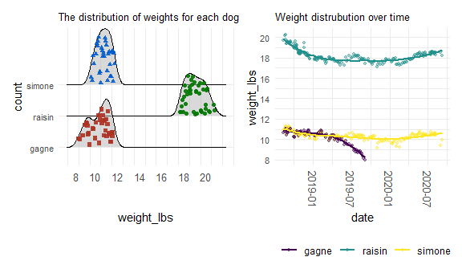

p8105\_mtp\_cz2634
================
Chenxin Zhang
10/20/2020

## Problem 1 Tidy and clean data

**Introduction and Goal of the Report**

The raw data record the weights of three dogs named “Simon, Gagne, and
Raisin” over 2 years with a standard object weighed. There are 206 rows
and 6 columns. The goal of the report is to analyze the weight
distribution of the three dogs over time.

**Import, tidy, and clean the data**

``` r
#change the weights unit from lbs_oz to lbs for three dogs and the standard object
#read the excel, "skip" skip the first raw, "col_types" set the column type  
#use function clean_names() in janitor packages to clean data  
#drop the row based on the missing values in var. 'raisin,simone, gagne

dog_df = read_excel("./data/dogweights_07sept2020.xlsx", skip = 1, col_types = c("date", "guess", "guess", "guess", "guess", "text")) %>% 
  janitor::clean_names() %>% 
  select(-x6) %>% 
  separate(raisin, into = c("lbs", "oz"), sep = 2) %>% 
  mutate(
    lbs = as.numeric(lbs),
    oz = as.numeric(oz),
    raisin = lbs + oz/16) %>% 
  select(-lbs, -oz) %>% 
  separate(simone, into = c("lbs", "oz"), sep = 2) %>% 
  mutate(
    lbs = as.numeric(lbs),
    oz = as.numeric(oz),
    simone = lbs + oz/16) %>% 
  select(-lbs, -oz) %>% 
  separate(gagne, into = c("lbs", "oz"), sep = 2) %>% 
  mutate(
    lbs = as.numeric(lbs),
    oz = as.numeric(oz),
    gagne = lbs + oz/16) %>% 
  select(-lbs, -oz) %>% 
  separate(std, into = c("lbs", "oz"), sep = 2) %>% 
  mutate(
    lbs = as.numeric(lbs),
    oz = as.numeric(oz),
    std = lbs + oz/16) %>% 
  select(-lbs, -oz) %>% 
  pivot_longer(
    raisin:gagne,
    names_to = "dog_name",
    values_to = "weight_lbs") %>%
  drop_na(weight_lbs) %>% 
   relocate(
    std, .after = weight_lbs 
  ) 
```

``` r
month_df = tibble(month = 1:12, month_name = month.name) 
```

``` r
#transfer oz to lbs by oz/16
#separate the variable "date" to three columns "year, month, date"
#change the variable type by mutate()
#join two data frame by left_join()
#delete columns by select(-*)
weight_df = dog_df %>% 
  separate(date, c("year", "month", "date")) %>% 
  mutate(month = as.integer(month)) %>% 
  left_join(month_df, by = "month") %>% 
  select(-month) %>% 
  select(year, month_name, everything()) %>% 
print()
```

    ## # A tibble: 515 x 6
    ##    year  month_name date  dog_name weight_lbs   std
    ##    <chr> <chr>      <chr> <chr>         <dbl> <dbl>
    ##  1 2018  August     12    raisin         19.8  NA  
    ##  2 2018  August     12    simone         10.9  NA  
    ##  3 2018  August     12    gagne          10.6  NA  
    ##  4 2018  August     19    raisin         20.2  21.0
    ##  5 2018  August     19    simone         11.1  21.0
    ##  6 2018  August     19    gagne          10.8  21.0
    ##  7 2018  August     22    raisin         20.2  21.0
    ##  8 2018  August     22    simone         11.2  21.0
    ##  9 2018  August     22    gagne          10.8  21.0
    ## 10 2018  August     24    raisin         19.8  21.0
    ## # ... with 505 more rows

  - The data frame ‘weight\_df’ is more tidy and readable. It delete
    rows where there is no record for weight of all three dogs, but keep
    rows when at least one weight is recorded.

**A dataframe that includes notes with date**

``` r
#change the variable name to "notes" by mutate()
#drop the row based on the missing values in var. 'notes'
notes_df = read_excel("./data/dogweights_07sept2020.xlsx", skip = 1, col_types = c("date", "guess", "guess", "guess", "guess", "text")) %>% 
  janitor::clean_names() %>% 
  mutate(notes = x6) %>%
  drop_na(notes) %>%  
  select(date, notes) %>% 
  separate(date, c("year", "month", "date")) %>% 
  mutate(month = as.integer(month)) %>% 
  left_join(month_df, by = "month") %>% 
  select(-month) %>% 
  select(year, month_name, everything())
print(notes_df)
```

    ## # A tibble: 14 x 4
    ##    year  month_name date  notes                                                 
    ##    <chr> <chr>      <chr> <chr>                                                 
    ##  1 2018  August     27    Right after leaving for 3 days at Weber's             
    ##  2 2018  September  04    at camp bow wow                                       
    ##  3 2018  October    01    dogs at Webers from Sept 18-30                        
    ##  4 2018  October    09    dogs at Webers from Oct 5-8                           
    ##  5 2018  October    16    on 10/15 all had hair cuts                            
    ##  6 2018  October    22    dogs at Webers from Oct 18-22                         
    ##  7 2018  November   18    dogs at Webers from Nov 10-17                         
    ##  8 2019  January    08    Simone/Gagne  at Webers from Dec 20-Jan 4, Raisin at ~
    ##  9 2019  September  06    Gagne died 9/8/2019                                   
    ## 10 2019  November   04    on vacation? Dogs at kennel?                          
    ## 11 2020  February   03    at Kennel?                                            
    ## 12 2020  May        23    first haircut in 3-4 months                           
    ## 13 2020  June       23    in PC June 23-July 10, no wts taken, Raisin with us, ~
    ## 14 2020  August     07    in Denver and PC aug 9-aug 31, no wts taken, Raisin w~

  - In this part, we produce a new data frame that include notes over
    time. There are totall 14 notes which records things happen to dog
    like moving place, hair cut, death of Gagne. All three dogs had hair
    cut on 10/15/2018. Raisin and Simone had another hair cut on
    5/23/2020, while Gagne hadn’t because of the pass away.

**export data frame**

``` r
#export the two data frame named ‘weight_df’ and ‘notes_df’ as CSVs
#Save the CSVs to the same directory as the raw data in working directory by giving the relative path.
write.csv(weight_df, "./data/weight.csv")
write.csv(notes_df, "./data/notes.csv")
```

## Problem 2 Summary of weight

**Briefly describe the resulting tidy dataset containing weights**  
\* The weights data recording the weights of the three dogs and a
standard object has 515 rows and 6 columns. There are 515 unique dates
are included in the dateset. By observation the raw data, there is a
miss recorded value of weight for raisin. The weight of raisin on
8/14/2019 is 7.9375 lbs while the records on near dates are all about
17.93 lbs. To analyze the data accurately, the analysis below will drop
the miss recorded value.

**summary of the weight**

``` r
#drop the value of 7.9375
dog_df2 = 
  dog_df %>% 
  select(-std) %>% 
   filter(weight_lbs != "7.9375")  
```

``` r
#mean, observation, SD with drop of '7.93' in raisin
dog_df3 = dog_df2 %>% 
  group_by(dog_name) %>%
  summarize(mean_weight = mean(weight_lbs, na.rm = TRUE),
            sd_weight = sd(weight_lbs, na.rm = TRUE),
            observation = n()) %>% 
  knitr::kable(digits = 1) 
print(dog_df3)
```

    ## 
    ## 
    ## |dog_name | mean_weight| sd_weight| observation|
    ## |:--------|-----------:|---------:|-----------:|
    ## |gagne    |        10.3|       0.7|         120|
    ## |raisin   |        18.3|       0.7|         201|
    ## |simone   |        10.4|       0.4|         193|

  - The data frame ‘dog\_df3’ shows a summary about the number of total
    observation, average weight and the standard deviation for each dog.
    There were 202 observations for Raisin, while the effective
    observations are 201 since we delete one miss recorded value. The
    mean weight of Raisin is 18.3, while it will be 18.2 if we do not
    drop the miss record value ‘7.9375’. The mean weights of Gagne and
    Simone are very close which are 10.3 and 10.4 respectively. Both
    weight values of Gagne and Raisin have a SD of 0.7, and the SD of
    weight value of Simone is 0.4, which reflects weight values of Gagne
    and Raisin are more spread from mean than that of Simone. Simone has
    a relatively stable weight than the other.

## Problem 3 Visualization

**two-panel plot**

``` r
weight_dis = dog_df2 %>%
  group_by(dog_name, weight_lbs) %>% 
  summarize(count = n()) %>% 
ggplot( aes(x = weight_lbs, y = dog_name, fill = count)) +
  geom_density_ridges(
    aes(point_color = dog_name, point_fill = count, point_shape = dog_name),
    alpha = .5, point_alpha = 0.9, jittered_points = TRUE
  ) +
  scale_point_color_hue(l = 40) +
  scale_discrete_manual(aesthetics = "point_shape", values = c(15, 16, 17)) +
  scale_x_continuous(
    breaks = seq(8,20,2))+
  theme(legend.position = ("none"),
    plot.title = element_text(lineheight = 4, color = "black", size = 10),
    axis.text.y = element_text(vjust = 0.5, hjust = 1, size = 8),
    axis.text.x = element_text(angle = 0, vjust = 0.5, hjust = 1, size = 10))+
  labs(title = "The distribution of weights for each dog",
    x = "weight_lbs",
    y = "count") +
  viridis::scale_color_viridis(discrete = TRUE)
```

``` r
weight_time = dog_df2 %>% 
  ggplot(aes(x = date, y = weight_lbs)) + 
  geom_point(aes(color = dog_name), alpha = .4, size = 1) +
  geom_smooth(aes(color = dog_name), se = FALSE) +
  scale_y_continuous(breaks = c(8, 10, 12, 14,16,18,20,22),
                     labels = c("8", "10", "12", "14", "16", "18", "20", "22"))+
  theme(legend.position = ("bottom"),
        legend.title = element_blank(),
    plot.title = element_text(lineheight = 4, color = "black", size = 10),
    axis.text.y = element_text(vjust = 0.5, hjust = 1, size = 8),
    axis.text.x = element_text(angle = -90, vjust = 0.5, hjust = 1, size = 10))+
  labs(title = "Weight distrubution over time",
       x = "date",
       y = "weight_lbs") +
  viridis::scale_color_viridis(
    discrete = TRUE
)
```

``` r
(weight_dis + weight_time)+ plot_layout(widths = 10, heights = 20)
```



  - By visualizing, we can more clearly see the weight difference among
    the three dogs. Raisin is almost two times heavy than the other two
    dogs, and the mean weight of Gagne and Simone are similar with some
    overlapping. The right pannel shows when time close to the death of
    Gagne, he lost weight over time from average 10 lbs to finally 8
    lbs. Some outliers exit in Simmone’s data, totally, the trend line
    reflects the reality. Raisin and Simmon have very similar weight
    gain or lose trend over the two years.
